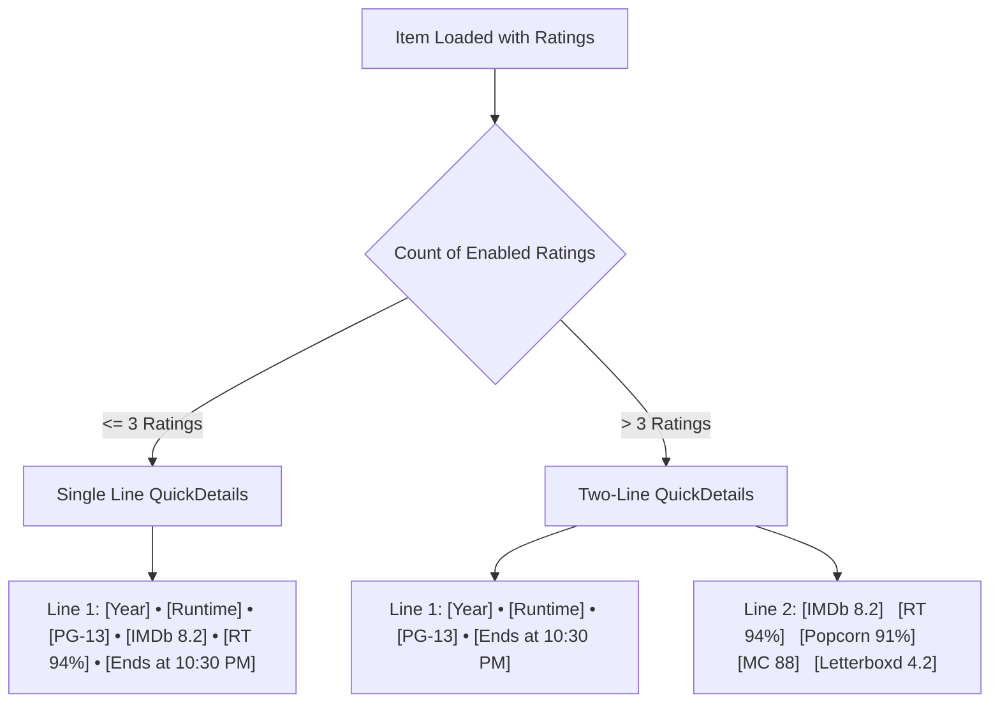

# Architecture & Implementation Plan: Multi-Source Ratings with Remux (MDBList Addon) and Wholphin

## Goal Description
Introduce comprehensive multi-source ratings support across the streaming stack using **Remux** (backend server) and **Wholphin** (Android TV / Android client):
- **Remux** hosts an **MDBList Addon** that queries the MDBList API for rich ratings (IMDb, Rotten Tomatoes Critics & Audience, Metacritic, Trakt, Letterboxd, MyAnimeList, Roger Ebert, TMDB). Remux handles API keys, rate-limiting, and central caching in SQLite so that **clients require zero setup** (just login and watch).
- **Wholphin** displays multiple ratings in a **customizable, adaptive layout**:
  - **Unified under `communityRating`**: All external ratings (both audience and critic scores) are presented as a unified ratings group rather than forcing separate isolated slots for "Community" vs "Critic".
  - **Adaptive Line Rule**:
    - If **$\le 3$ ratings** are active: Rendered **inline** in `QuickDetails` along with basic info (`Year • Runtime • PG-13 • 8.2 ★ • 94% 🍅 • Ends at 10:30 PM`).
    - If **$> 3$ ratings** are active: Shifted to a **dedicated separate line** directly beneath basic info to prevent TV screen clutter and text truncation (`Year • Runtime • PG-13 • Ends at 10:30 PM` on Line 1, and `8.2 [imdb]   94% [rt]   91% [popcorn]   88 [metacritic]   4.2 [letterboxd]` on Line 2).

---

## Key Design Principles & Clarifications

### 1. Protocol / Wire Level vs. UI Model Level
> [!NOTE]
> **Why `BaseItemDto.communityRating` on the wire must remain a `Float`**:
> In the standard Jellyfin OpenAPI schema and the compiled `jellyfin-model-jvm` Kotlin SDK, `BaseItemDto.communityRating` is typed strictly as `Float?` (e.g. `7.8`).
> If Remux sends a non-numeric string or array in the JSON `{"CommunityRating": ...}`, Jellyfin SDK's `kotlinx.serialization` will fail with a `SerializationException` and crash the client.
>
> **The Solution**:
> - **On the wire (Remux $\to$ Wholphin)**:
>   - Remux keeps standard `communityRating` as a valid `Float` (primary score, e.g. IMDb `8.2`) and `criticRating` as a valid `Float` (`94.0`) so standard clients don't break.
>   - The complete multi-rating set is transmitted via `BaseItemDto.remux.ratings` (typed Remux extension) and/or `providerIds` (e.g. `"Rating:imdb": "8.2"`, `"Rating:rt": "94%"`), which Jellyfin SDK parses cleanly as `Map<String, String>`.
> - **In Wholphin (Domain & UI Model)**:
>   - Wholphin treats all ratings under the umbrella of `communityRating` / Ratings Group.
>   - Wholphin's `QuickDetailsData` binds all incoming scores into a single `ratings: List<RatingBadgeItem>`.
>   - Controlled by the user's `DisplayToggle.COMMUNITY_RATING` toggle (and source-level preferences).

---

## Layout Architecture: Adaptive 1-Line vs 2-Line Rule



### Visual Representation on TV Screen
**Scenario A: $\le 3$ Ratings (Compact Inline)**
```text
2024 • 2h 15m • PG-13 • 8.4 [imdb] • 93% [fresh] • 88 [mc] • Ends at 10:30 PM
Action • Sci-Fi • Adventure
4K • HDR10 • 5.1
```

**Scenario B: $> 3$ Ratings (Dedicated Ratings Row)**
```text
2024 • 2h 15m • PG-13 • Ends at 10:30 PM
8.4 [imdb]   93% [fresh]   91% [popcorn]   88 [mc]   4.3 [letterboxd]   85% [trakt]
Action • Sci-Fi • Adventure
4K • HDR10 • 5.1
```

---

## Proposed Changes

### Component 1: Remux Server (`crates/remux-server` & `crates/remux-sdks`)

#### [NEW] `crates/remux-server/src/addons/mdblist.rs`
- Implements `AddonPreset` and `MetaAddon`.
- Operator configuration options:
  - `api_key`: Password / string (MDBList user API key).
  - `primary_audience_source`: Default source for standard `media.rating_audience` (`"imdb"`, `"tmdb"`, `"trakt"`, `"letterboxd"`).
  - `primary_critic_source`: Default source for standard `media.rating_critic` (`"rt"`, `"metacritic"`).
- In `meta_fetch(&self, media, ctx, config)`:
  - Looks up rating via `media.external_ids.imdb` (or `tmdb` ID fallback).
  - Deserializes MDBList JSON response.
  - Updates `db::ExternalRatings` with all parsed ratings: IMDb, RT Critic, RT Audience, Metacritic, Trakt, Letterboxd, MAL, Roger Ebert, MDBList.
  - Sets `media.rating_audience` and `media.rating_critic` based on primary preferences.

#### [MODIFY] `crates/remux-server/src/db/media.rs`
- Expand `ExternalRatings` struct:
```rust
#[skip_serializing_none]
#[derive(Debug, Clone, Default, Serialize, Deserialize)]
pub struct ExternalRatings {
    pub tmdb: Option<Rating>,
    pub imdb: Option<Rating>,
    pub rt_critic: Option<Rating>,
    pub rt_audience: Option<Rating>,
    pub metacritic: Option<Rating>,
    pub trakt: Option<Rating>,
    pub letterboxd: Option<Rating>,
    pub mal: Option<Rating>,
    pub mdblist: Option<Rating>,
    pub roger_ebert: Option<Rating>,
}
```
*(No SQLite table migration required — stored in existing `external_ratings TEXT` JSON column).*

#### [MODIFY] `crates/remux-server/src/addons/mod.rs`
- Register `pub mod mdblist;`
- In `merge_media`: Ensure `rating_critic` is merged (`merge_option(&mut target.rating_critic, &source.rating_critic, replace);`).

#### [MODIFY] `crates/remux-sdks/src/remux/mod.rs` & `crates/remux-server/src/api/models.rs`
- Add `RemuxRatingDto` and add `ratings: Option<Vec<RemuxRatingDto>>` to `RemuxInfo`.
- In `api/models.rs`, populate both:
  1. `BaseItemDto.remux.ratings` (typed structured list).
  2. `BaseItemDto.provider_ids` with `"Rating:<source>": "<value>"` (e.g. `"Rating:imdb": "8.2"`, `"Rating:rt": "94%"`), enabling Wholphin to read all ratings directly from `item.data.providerIds` without custom raw JSON parsing.

---

### Component 2: Wholphin Android Client (`Wholphin/app`)

#### [NEW] `app/src/main/java/com/github/damontecres/wholphin/data/model/RatingBadgeItem.kt`
- Domain model representing an individual rating score:
  ```kotlin
  data class RatingBadgeItem(
      val source: RatingSource,     // IMDB, RT_CRITIC, RT_AUDIENCE, METACRITIC, TRAKT, LETTERBOXD, TMDB, MAL, EBERT
      val formattedValue: String,   // "8.2", "94%", "88", "4.1"
      val inlineToken: String,      // "imdb", "fresh", "rotten", "popcorn_fresh", "metacritic", "letterboxd", "trakt"
  )
  ```
- Parser function extracting ratings from `BaseItemDto`:
  - Parses from `item.data.providerIds` (keys starting with `Rating:`) or `remux.ratings`.
  - Fallback: Uses standard `item.data.communityRating` (gold star) and `criticRating` (tomato) if only legacy fields exist.

#### [MODIFY] `WholphinDataStore.proto` & `AppPreference.kt`
- User customization in Settings:
  - Source selection: Allow users to toggle individual sources (e.g., enable IMDb, RT Critic, RT Audience, Metacritic; disable Letterboxd, MAL).
  - Managed under the existing `DisplayToggle.COMMUNITY_RATING` or a dedicated ratings configuration sub-dialogue.

#### [MODIFY] `app/src/main/java/com/github/damontecres/wholphin/data/model/BaseItem.kt`
- In `QuickDetailsData`:
  ```kotlin
  data class QuickDetailsData(
      val basic: AnnotatedString? = null,
      val officialRating: AnnotatedString? = null,
      val ratings: List<RatingBadgeItem> = emptyList(),
      val communityRating: AnnotatedString? = null, // Formatted fallback string
  )
  ```
- Constructs `ratings` from `data.providerIds` / `remux`.

#### [MODIFY] `app/src/main/java/com/github/damontecres/wholphin/ui/components/QuickDetails.kt`
- Implement the **Adaptive Line Rule**:
  ```kotlin
  @Composable
  fun QuickDetails(
      details: QuickDetailsData?,
      timeRemaining: Duration?,
      modifier: Modifier = Modifier,
      textStyle: TextStyle = MaterialTheme.typography.titleSmall,
      endsAt: DateTime? = null,
  ) {
      val enabled = LocalInterfaceCustomization.current.enabledDisplayToggles
      val showRatings = DisplayToggle.COMMUNITY_RATING in enabled
      val ratings = if (showRatings) details?.ratings.orEmpty() else emptyList()
      val inlineContentMap = rememberQuickDetailsContentMap(textStyle)

      if (ratings.size <= 3) {
          // Compact 1-Line Layout
          Row(modifier = modifier) {
              QuickDetailsText(details?.basic, Modifier, textStyle, inlineContentMap)
              if (DisplayToggle.OFFICIAL_RATING in enabled) {
                  QuickDetailsText(details?.officialRating, Modifier, textStyle, inlineContentMap)
              }
              // Ratings rendered inline
              for (rating in ratings) {
                  QuickDetailsRatingBadge(rating, textStyle, inlineContentMap, prependDot = true)
              }
              if (timeRemaining != null) TimeRemaining(timeRemaining, textStyle = textStyle)
              else if (endsAt != null) EndsAt(endsAt, textStyle = textStyle)
          }
      } else {
          // 2-Line Layout: Line 1 = Metadata, Line 2 = Ratings Row
          Column(verticalArrangement = Arrangement.spacedBy(4.dp), modifier = modifier) {
              Row {
                  QuickDetailsText(details?.basic, Modifier, textStyle, inlineContentMap)
                  if (DisplayToggle.OFFICIAL_RATING in enabled) {
                      QuickDetailsText(details?.officialRating, Modifier, textStyle, inlineContentMap)
                  }
                  if (timeRemaining != null) TimeRemaining(timeRemaining, textStyle = textStyle)
                  else if (endsAt != null) EndsAt(endsAt, textStyle = textStyle)
              }
              Row(horizontalArrangement = Arrangement.spacedBy(12.dp)) {
                  for (rating in ratings) {
                      QuickDetailsRatingBadge(rating, textStyle, inlineContentMap, prependDot = false)
                  }
              }
          }
      }
  }
  ```
- Extend `rememberQuickDetailsContentMap` with vector / raster icons for `imdb`, `popcorn_fresh`, `popcorn_spilled`, `metacritic`, `letterboxd`, `trakt`.

---

## Verification Plan

### Automated Tests
1. **Remux Server**:
   - Test MDBList API response deserialization and badge extraction.
   - Test `ExternalRatings` database persistence and `merge_media`.
   - Test `BaseItemDto` serialization includes `ProviderIds` rating keys and `remux.ratings`.
   ```bash
   cargo test -p remux-server addons::mdblist
   cargo test -p remux-server db::media
   ```

2. **Wholphin Client**:
   - Unit test `RatingBadgeItem` parsing with $\le 3$ and $> 3$ ratings.
   - Unit test `QuickDetails` layout switching between single-line and two-line modes.
   ```bash
   ./gradlew :app:testDebugUnitTest --tests "*Rating*"
   ```

### Manual Verification
1. Verify 1-line display when item has $\le 3$ ratings (e.g. IMDb, RT, MC).
2. Verify 2-line layout cleanly activates when 4 or more ratings are active.
3. Test disabling individual sources in Settings to ensure layout collapses back to 1 line seamlessly.
4. Verify non-Remux Jellyfin servers continue to render legacy single community star rating without errors.
